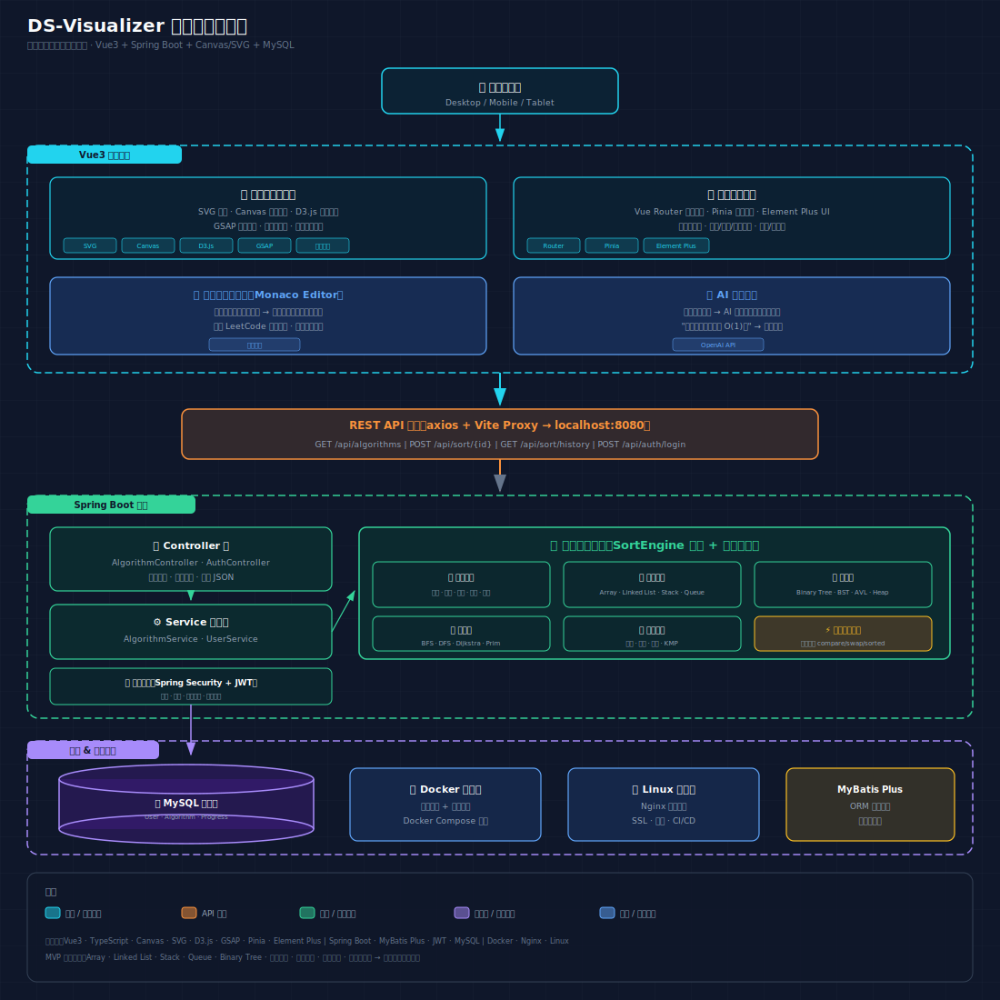

# DS-Visualizer — Data Structure Visualization Platform

An interactive educational platform that visualizes data structures and algorithms through step-by-step animations.

🌐 **Live Demo:** [hanhan362.github.io/ds-visualizer-](https://hanhan362.github.io/ds-visualizer-/)



---

## Features

### Data Structure Visualizations (8 modules)

| Module | Route | Operations | Engine |
| --- | --- | --- | --- |
| Array | `/array` | push / pop / shift / unshift | SVG bar chart |
| Linked List | `/linked-list` | Prepend / Append / Delete / Reverse | SVG nodes + arrows |
| Stack / Queue | `/stack-queue` | LIFO & FIFO dual mode | SVG bar chart |
| Sorting | `/sort` | Bubble / Selection / Insertion / Quick / Merge | Canvas bar chart |
| Binary Tree | `/tree` | Preorder / Inorder / Postorder traversal | SVG tree |
| Graph | `/graph` | BFS / DFS layer coloring | SVG graph |

### User System

- JWT-based authentication (register / login)
- Personal center with operation history, favorites, notes, and learning progress
- Route guards for protected pages
- Axios interceptor for automatic token attachment and 401 handling

### Animation Controls

- Play / Pause / Reset / Replay
- Adjustable speed (slider control)
- Step progress bar with drag support
- Color-coded states (default / comparing / swapping / sorted)

---

## Tech Stack

| Layer | Technology |
| --- | --- |
| Frontend Framework | Vue 3 + TypeScript + Vite |
| Routing | Vue Router 4 (Hash mode) |
| State Management | Pinia |
| UI Components | Element Plus + Tailwind CSS v4 |
| Visualization | SVG (arrays, lists, trees, graphs) + Canvas (sorting) |
| HTTP Client | Axios with JWT interceptor |
| Backend (Primary) | Node.js + Express + TypeScript |
| ORM | Prisma |
| Backend (Alternative) | Spring Boot 3 + JPA + Hibernate |
| Database | MySQL 8.0 (production) / H2 (development) |
| Authentication | JWT + BCrypt |

---

## Quick Start

### Prerequisites

- Node.js 18+
- MySQL 8.0 (or use H2 for development)

### 1. Database Setup

```bash
# Start MySQL service
net start MySQL80

# Create database
mysql -u root -p -e "CREATE DATABASE IF NOT EXISTS ds_visualizer CHARACTER SET utf8mb4 COLLATE utf8mb4_unicode_ci;"
```

### 2. Backend (Node.js)

```bash
cd backend-node
npm install
npx prisma generate
npx tsx src/index.ts
# Server running on http://localhost:8080
```

### 3. Frontend

```bash
cd frontend
npm install
npm run dev
# Open http://localhost:5173
```

### Alternative Backend (Spring Boot)

```bash
cd backend
mvn spring-boot:run -Dspring-boot.run.profiles=mysql
```

---

## Project Structure

```
ds-visualizer-fullstack/
├── frontend/                       # Vue3 Frontend
│   └── src/
│       ├── views/                  # 10 page components
│       │   ├── HomeView.vue        # Landing page
│       │   ├── ArrayView.vue       # Array visualization
│       │   ├── LinkedListView.vue  # Linked list visualization
│       │   ├── StackQueueView.vue  # Stack/Queue visualization
│       │   ├── SortView.vue        # Sorting visualization
│       │   ├── TreeView.vue        # Binary tree visualization
│       │   ├── GraphView.vue       # Graph visualization
│       │   ├── LoginView.vue       # Login page
│       │   ├── RegisterView.vue    # Registration page
│       │   ├── ProfileView.vue     # User profile
│       │   ├── LearningCenter.vue  # Learning center
│       │   └── NotFoundView.vue    # 404 page
│       ├── components/             # Reusable components
│       │   ├── layout/             # AppHeader, AppFooter
│       │   ├── array/              # ArraySvg component
│       │   ├── linkedlist/         # LinkedListSvg component
│       │   ├── tree/               # TreeSvg component
│       │   └── graph/              # GraphSvg component
│       ├── composables/            # Animation engines (6 total)
│       ├── algorithms/             # Client-side sorting (5 algorithms)
│       ├── store/                  # Pinia user store
│       ├── router/                 # Vue Router + guards
│       ├── api/                    # Axios wrappers
│       ├── utils/                  # Utility functions
│       └── types/                  # TypeScript type definitions
│
├── backend-node/                   # Node.js Backend (recommended)
│   └── src/
│       ├── index.ts                # Express entry point
│       ├── middleware/auth.ts      # JWT authentication middleware
│       ├── routes/
│       │   ├── auth.ts             # Login/Register endpoints
│       │   ├── algorithms.ts       # Sorting API endpoints
│       │   └── userData.ts         # History/Favorites/Notes/Progress
│       └── engines/
│           └── sorting.ts          # 5 sorting algorithm engines
│
├── backend/                        # Spring Boot Backend (alternative)
│   └── src/main/java/com/dsvisualizer/
│       ├── controller/             # REST API controllers
│       ├── service/                # Business logic
│       ├── engine/                 # Sorting engines
│       ├── entity/                 # JPA entities
│       ├── repository/             # Spring Data JPA
│       ├── security/               # JWT + Security config
│       ├── dto/                    # Data transfer objects
│       └── exception/              # Global exception handler
│
├── docs/                           # Documentation
│   ├── TECHNICAL.md                # Technical documentation
│   └── REQUIREMENTS.md             # Requirements specification
├── diagram/                        # Architecture diagram
├── .github/workflows/              # CI/CD pipelines
└── README.md                       # This file
```

---

## API Reference

All endpoints return unified format: `{ "code": 200, "message": "success", "data": {...} }`

| Method | Endpoint | Auth | Description |
| --- | --- | --- | --- |
| POST | `/api/register` | No | Register new user |
| POST | `/api/login` | No | Login, returns JWT |
| GET | `/api/algorithms` | No | List all algorithms |
| POST | `/api/sort/{id}` | No | Run sort, returns step sequence |
| GET | `/api/sort/history` | No | Sort execution history |
| GET | `/api/history` | JWT | User operation history |
| POST | `/api/history` | JWT | Record operation |
| GET | `/api/favorites` | JWT | User favorites |
| POST | `/api/favorites` | JWT | Toggle favorite |
| GET | `/api/notes` | JWT | User notes |
| POST | `/api/notes` | JWT | Save note |
| GET | `/api/progress` | JWT | Learning progress |
| POST | `/api/progress` | JWT | Record progress |

### Test Account

```
Username: test123
Password: test123
```

---

## Database

MySQL 8.0 — 7 tables: `users`, `history`, `favorites`, `notes`, `algorithms`, `execution_history`, `learning_progress`.

See `docs/TECHNICAL.md` for full schema details.

---

## Deployment

- **Frontend:** GitHub Pages (auto-deploy via GitHub Actions)
- **Backend:** `tunnel.bat` for serveo public tunnel, or deploy to Railway/Render
